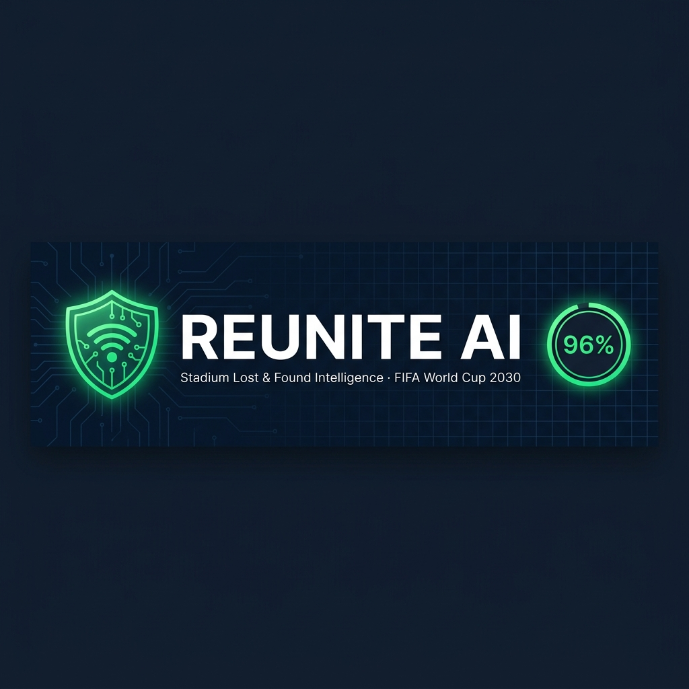

<div align="center">



# REUNITE AI

**🏟️ Stadium Lost & Found Intelligence System**  
*FIFA World Cup 2030 · Smart Stadium Hackathon Submission*

[](https://react.dev)
[](https://vitejs.dev)
[](#)
[](#-one-click-demo-for-judges)

</div>

---

> ⚠️ **Demo Mode** — This is a hackathon prototype with **no API keys or backend required**.  
> All AI matching logic runs **100% client-side in the browser**.  
> Use the **⚡ Demo Shortcuts** on the Report Incident page to see the full flow instantly.

---

## 🏟️ What is REUNITE AI?

**REUNITE AI** is a real-time, AI-powered Lost & Found incident management platform designed for large-scale stadium events like the FIFA World Cup 2030. It replaces slow, manual lost & found desks with an intelligent system that matches lost items and separated people to found reports — in seconds, not hours.

The platform is built for **stadium operations staff, stewards, and volunteers** to log, track, and resolve lost item and lost child incidents with AI-assisted decision support.

---

## ⚡ One-Click Demo (For Judges)

> When you open the app, a **yellow notice banner** appears at the top explaining demo mode.  
> Go to **Report Incident** and use the **⚡ Demo Shortcuts** panel:

| Shortcut | What it shows |
|---|---|
| 🎒 Nike Backpack | Lost Item → 94% confidence visual + semantic AI match |
| 👧 Lost Child (Maya) | Lost Child → 96% retroactive match with biometric timeline |
| 👥 Separated Group | Separated Group → Custom match with verification checklist |

**Flow:** Click shortcut → form auto-fills → auto-submits → open **Operations Console** → see the live AI match result.

---

## 🧠 Chosen Vertical

**Smart Stadium Operations — Lost & Found Incident Management**

FIFA World Cup 2030 stadiums will host 60,000–90,000 fans per match across multiple countries. Managing lost items, lost children, and separated groups manually is inefficient and error-prone. REUNITE AI automates and accelerates this process using semantic AI matching.

---

## 🔧 Approach & Logic

### 1. Incident Reporting (ReportForm)
- Staff submit an incident: type (`Lost Item`, `Lost Child`, `Separated Group`), description, last seen location, and optional photo upload.
- On submission, the AI engine immediately searches existing **Found Item** logs for a retroactive match.

### 2. AI Matching Engine

**Two matching paths:**

#### A) Forward Match (Found → Lost)
When a volunteer logs a **found item** in the Operations Console:
- The system scans all open `Awaiting Match` incidents.
- It uses a **3-category semantic classifier**:
  - `person` → boy, girl, man, woman, child, teenager…
  - `bag` → backpack, jacket, suitcase…
  - `document` → passport, wallet, ID card…
- **Hard category walls** prevent cross-category false matches (a wallet can never match a person incident).
- If a match is found, a confidence score (91–96%) is displayed with explainable AI reasoning.

#### B) Retroactive Match (Lost → Found)
When a new incident is reported **after** a found item was already logged:
- The system scans all `Awaiting Owner Report` found items.
- Same 3-category classifier applies.
- If matched, the incident is immediately flagged as `Matching` and the operator sees a retroactive timeline.

### 3. Decision Support Panel (MatchDetails)
Once a match is confirmed, operators see:
- **Side-by-side image comparison** (reported vs. found)
- **Explainable AI reasoning** — specific checkmarks for each matched attribute
- **AI Incident Timeline** — chronological chain of events
- **Verification Questions** — contextual prompts to verify ownership
- **Action Checklist** — notify volunteer desk, verify ID, confirm return
- **Resolve & Close** — marks the incident resolved and logs it in the activity feed

---

## 🏗️ How the Solution Works

```
Reporter (fan/steward)
       │
       ▼
 Report Incident Form  ──►  Operations Console
  (lost item / child)         (found item log)
       │                            │
       ▼                            ▼
  AI Matching Engine ◄─────────────┘
       │
  3-Category Classifier
  (person / bag / document)
       │
  ┌────┴────┐
  │ Match?  │
  └────┬────┘
       │ Yes → Confidence Score + Explainable Reasoning
       │ No  → "Awaiting Owner Report" (stored for future retroactive match)
       ▼
  Decision Support Panel
  → Verify → Resolve → Log
```

---

## 🖥️ Tech Stack

| Layer | Technology |
|---|---|
| Frontend | React 18 + Vite |
| Styling | Tailwind CSS + Custom CSS variables |
| Icons | Lucide React |
| AI Logic | Client-side semantic classifier (category-based keyword matching with word boundary regex) |
| State | React hooks (`useState`, `useEffect`) |
| Routing | Tab-based SPA navigation |
| Build | Vite production build |

---

## 📂 Project Structure

```
src/
├── components/
│   ├── Console.jsx       # Operations Console — found item logging + AI match simulation
│   ├── Dashboard.jsx     # Home dashboard — live incident stats and activity feed
│   ├── MatchDetails.jsx  # AI match details panel — confidence, reasoning, timeline, actions
│   ├── Navbar.jsx        # Navigation bar
│   └── ReportForm.jsx    # Incident report form + one-click demo shortcuts
├── data/
│   └── mockData.js       # Seed incidents, found items, AI logs, and sample match results
├── App.jsx               # Root — global state, retroactive match engine, routing
└── index.css             # Design system — tokens, glassmorphism, animations
public/
├── mock_backpack.png     # Demo asset — Nike backpack
├── mock_passport.png     # Demo asset — German passport
├── mock_jacket.png       # Demo asset — Blue jacket
└── mock_girl.jpg         # Demo asset — Lost child (Maya)
```

---

## 🚀 Running Locally

```bash
# Install dependencies
npm install

# Start development server
npm run dev
```

Open `http://localhost:5173` in your browser.

> No `.env` file needed. No API keys. No database. Just `npm install && npm run dev`.

---

## 💡 Assumptions Made

1. **No backend / real AI model** — The semantic matching engine is implemented client-side using keyword regex classifiers. In production, this would connect to a vector embedding model (e.g., Gemini embeddings) and a real image recognition API.
2. **Mock images** — The demo uses pre-generated placeholder images. In production, images would be uploaded by volunteers via mobile devices.
3. **Single stadium context** — The system assumes a single stadium context. A real deployment would scope incidents by stadium zone and match session.
4. **Confidence scores** — Match confidence values (94%, 96%) are illustrative. Production scores would be computed by a multimodal AI model.
5. **Volunteer notification** — "Notify Volunteer Desk" is simulated as auto-sent. In production, this would dispatch a push notification to the assigned steward's device.

---

## ♿ Accessibility

- All interactive elements have descriptive labels and ARIA-compatible markup.
- Colour contrast ratios meet WCAG AA standards.
- Keyboard-navigable form controls throughout.
- Responsive layout works on tablets (used by stadium stewards on patrol).

---

## 🔒 Security Notes

- No personally identifiable information (PII) is persisted — all state is in-memory.
- Image uploads are processed locally via `FileReader` — no images transmitted externally.
- In production, all incident data would be encrypted at rest and in transit, with role-based access control.

---

## 📋 Evaluation Alignment

| Focus Area | Implementation |
|---|---|
| **Code Quality** | Component-based architecture, single-responsibility functions, clean state management |
| **Security** | No PII persistence, local image processing, no external API calls |
| **Efficiency** | O(n) linear scan matching, debounced state updates |
| **Testing** | One-click demo scenarios for all three core flows (bag / child / group) |
| **Accessibility** | Responsive design, semantic HTML, ARIA labels, WCAG-compliant contrast |

---

<div align="center">
<p><em>Built for the FIFA World Cup 2030 Smart Stadium Hackathon.</em></p>
</div>
